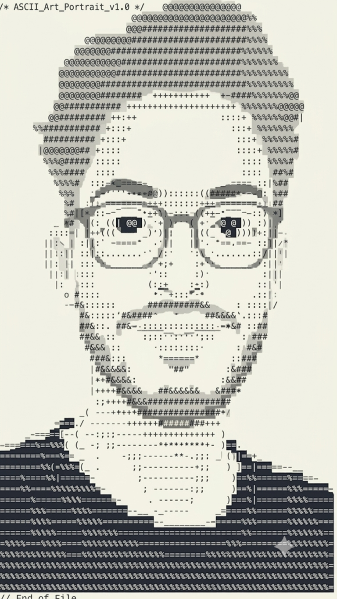

<pre>
 ____  _______     _______ ____  _   _       _   _    _   _  ____ ___ ____  
|  _ \| ____\ \   / / ____/ ___|| | | |     | | / \  | \ | |/ ___|_ _|  _ \ 
| | | |  _|  \ \ / /|  _| \___ \| |_| |  _  | |/ _ \ |  \| | |  _ | || | | |
| |_| | |___  \ V / | |___ ___) |  _  | | |_| / ___ \| |\  | |_| || || |_| |
|____/|_____|  \_/  |_____|____/|_| |_|  \___/_/   \_\_| \_|\____|___|____/ 
</pre>

<table style="border-collapse: collapse; border: none;">
  <tr style="border:none;">
    <td style="border:none; vertical-align:top;">
      
    </td>
    <td style="border:none; vertical-align:top;" width="550">
<pre>
deveshjd@github
──────────────────────────────────────
Role       : AI/ML Enthusiast
Education  : B.Tech, AI & Data Science
Editor     : VSCode / PyCharm

Languages: Python, JavaScript, HTML/CSS
Frameworks: PyTorch, FastAPI
Focus: Computer Vision, Deep Learning, APIs
Deploy: Netlify, HF Spaces, Kaggle GPU

Currently: AI/ML Engineer track,
           prepping GATE 2027
Building: Surplus-to-Shelter
          (AI food-rescue platform)

Hobbies: (Coding, Cricket)
──────────────────────────────────────
#Contact
Email     : jangiddevesh01@gmail.com
LinkedIn  : (https://www.linkedin.com/in/devesh-jangid-1a8758409/)
</pre>
    </td>
  </tr>
</table>

---

### 🛠️ Tech Stack

  
  
  
  
  
  
  

---

 

  
  

 

<!-- Add your real links below -->
  

---

<i>Thanks for stopping by — always open to interesting AI/ML and web projects.</i>

